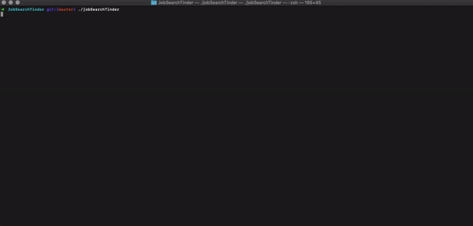

    

    <h2>Welcome to JobSearchTinder!</h2>

 
 

This is the scraper part of a bigger project. The premise of JobSearchTinder is to make Job Search more fun and enjoyable, while providing job board functionality and transparency to users. The JobSearchTinder scraper goes out and scrapes multiple JobBoards for specific positions and saves this data. Once users start "swiping right" or "swiping left", those actions get fed into a recommender model, which learns what kind of job postings you like more and gives you recommendations. 

